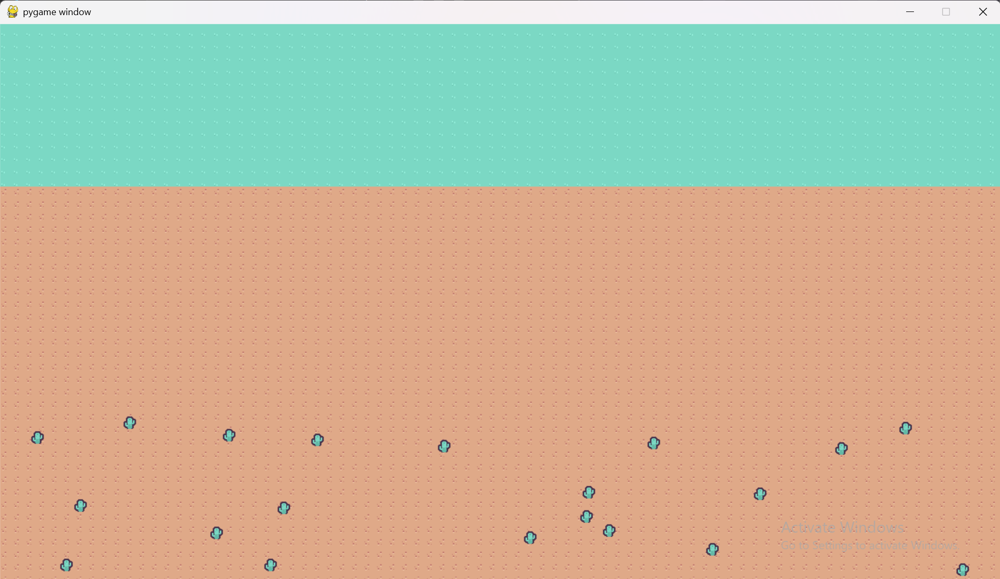

Desert Strike: A Top-Down Arena Shooter

Description:
Desert Strike is a fast-paced, top-down arena shooter built in Pygame. Players must survive against endless waves of enemies that get progressively faster and more difficult. Enter your name, aim for the high score, and see how long you can last!

Features:
Endless Wave System: Enemies get faster and more numerous with each new wave.
Persistent High Scores: The game saves the Top 5 scores in a high_scores.json file, so you can compete for the top spot.
Player Name Entry: Enter your name on the title screen to be immortalized on the high score list.
Full Game Loop: A complete game with a Title Screen, a 'Playing' state, and a Game Over screen.
Smooth Controls: Classic WASD/Arrow key movement and intuitive mouse-based aiming.

How to Play:
1. Run the Game:
You will need pygame installed to run the game.
Then, run the main file:
python main.py

2. Controls:
Move: W, A, S, D or Arrow Keys
Aim: Mouse
Shoot: Left Mouse Click
Reload: R Key
Start Game: Type your name and press Enter
Restart Game: Press R from the "Game Over" screen

Screenshots:
Title Screen (with High Scores)

Gameplay in Action

Game Over Screen
