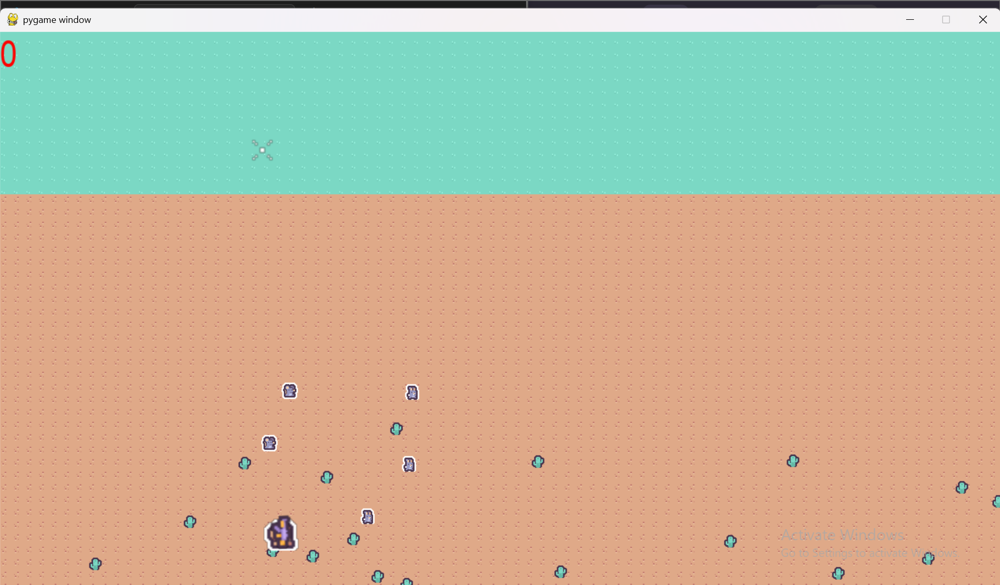

# Desert Strike


## Description

**Desert Strike** is a fast-paced, top-down arena shooter built with Pygame. Players must survive against endless waves of enemies that increase in speed and difficulty. Test your reflexes, aim for the high score, and see how long you can survive the onslaught!

## Features

- **Endless Waves**: Enemies become faster and more aggressive as you progress.
- **Weapon System**: Shotguns and Machine Guns with unique firing mechanics.
- **Extreme Vibe**: Focus Mode (Bullet Time) and Dash abilities.
- **Audio Overhaul**: Full sound effects for every action.
- **Persistent High Scores**: Local leaderboard tracks the top 5 players.

## Installation

1. **Clone the repository**:

   ```bash
   git clone <repository_url>
   cd Final_project
   ```

2. **Install Dependencies**:

   ```bash
   pip install -r requirements.txt
   ```

## How to Play

Run the game using Python:

```bash
python main.py
```

### Controls

| Action | Key |
| :--- | :--- |
| **Move** | `W`, `A`, `S`, `D` or Arrow Keys |
| **Aim** | Mouse Cursor |
| **Shoot** | Left Mouse Button |
| **Dash** | `Space` |
| **Focus Mode** | `Left Shift` |
| **Reload** | `R` |
| **Pause** | `P` |

## Screenshots

### Title Screen


### Gameplay



### Game Over

